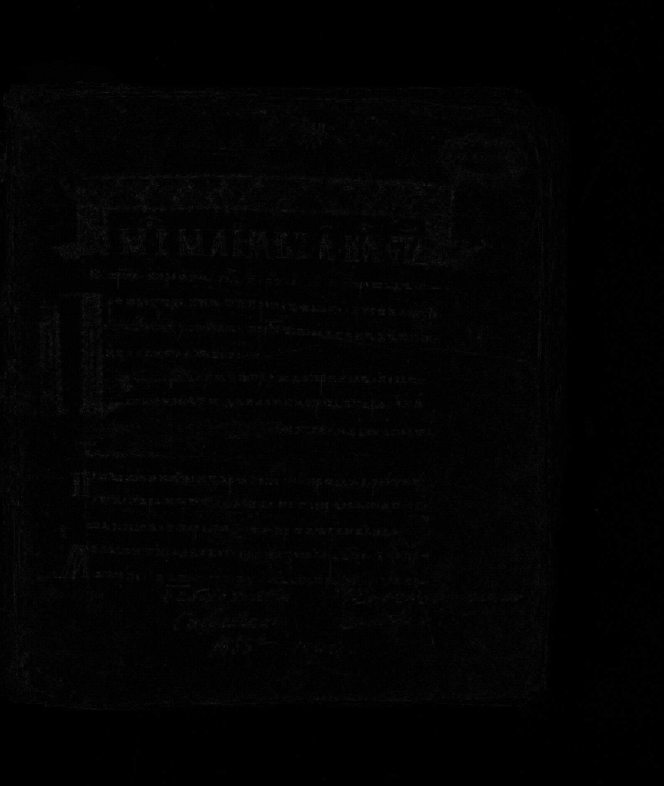

# Лабораторная работа №3
## Фильтрация изображений и морфологические операции

### Описание

В данной лабораторной работе реализована фильтрация полутоновых изображений с помощью **рангового фильтра** (медианного типа) без использования готовых библиотечных функций фильтрации.

Для варианта 6 используется:

- окно **3×3**;
- разреженная маска **«косой крест»**:

```text
1 0 1
0 1 0
1 0 1
```


- ранг 3/5

Для каждого входного изображения выполняются две ветки обработки:

1. **Полутоновая ветка**
   - перевод полноцветного изображения в полутоновое по формуле  
     `Y = 0.299R + 0.587G + 0.114B`;
   - ранговая фильтрация полутонового изображения с окном **3×3**, разреженной маской **«косой крест»**  
     ```text
     1 0 1
     0 1 0
     1 0 1
     ```
     и рангом **3/5**;
   - построение разностного изображения как **модуля разности** `|I - F|`, где `I` — исходное полутоновое изображение, `F` — результат фильтрации;
   - дополнительное усиление разности умножением на `10`, так как без этого изменения после фильтрации визуально слабо заметны.

2. **Монохромная ветка**
   - перевод полутонового изображения в монохромное методом пороговой обработки:
     - `gray >= 128 → 255`
     - `gray < 128 → 0`;
   - ранговая фильтрация монохромного изображения с тем же окном **3×3**, маской **«косой крест»** и рангом **3/5**;
   - построение разностного изображения как **XOR** между исходным и отфильтрованным монохромным изображением.

### Исходные изображения

В качестве исходных данных используются полноцветные изображения, загружаемые через API сайта https://www.slavcorpora.ru.

| Исходное изображение 1 | Исходное изображение 2 | Исходное изображение 3 |
|---|---|---|
|  |  |  |

---

# Приведение изображения к полутону

Полутоновое изображение строится вручную по формуле взвешенного усреднения каналов:

```text
Y = 0.299R + 0.587G + 0.114B
```

| Полутоновое изображение 1 | Полутоновое изображение 2 | Полутоновое изображение 3 |
|---|---|---|
|  |  |  |

---
# Перевод полутонового изображения в монохромное

Используется пороговая обработка:

- gray >= 128 → 255
- gray < 128 → 0

| Монохромное изображение 1 | Монохромное изображение 2 | Монохромное изображение 3 |
|---|---|---|
|  |  |  |

---

# Ранговая фильтрация

ля каждого полутонового изображения применяется ранговый фильтр с маской **косой крест 3×3** и рангом **3/5**.  
Из 5 значений, попадающих под маску, выбирается **3-й по возрастанию элемент**.

| Отфильтрованное полутоновое 1 | Отфильтрованное полутоновое 2 | Отфильтрованное полутоновое 3 |
|---|---|---|
|  |  |  |

Для каждого изображения полутоновое изображение сначала переводится в монохромное, после чего к нему применяется ранговый фильтр с той же маской **косой крест 3×3** и рангом **3/5**.  
В этом случае выходной пиксель становится белым, если среди 5 элементов маски не меньше **3 белых пикселей**, иначе — чёрным.


| Отфильтрованное монохромное 1 | Отфильтрованное монохромное 2 | Отфильтрованное монохромное 3 |
|---|---|---|
|  |  |  |

---

# Разностные изображения

Для полутоновых изображений разностное изображение вычисляется как **модуль разности** между исходным и отфильтрованным изображением:

```text
|I - F|
```

| Разность полутонового 1 | Разность полутонового 2 | Разность полутонового 3 |
|---|---|---|
|  |  |  |

Так как полученное разностное полутоновое изображение оказалось визуально слишком тёмным, дополнительно была выполнена контрастировка умножением на 10.

| Разность полутонового 1 | Разность полутонового 2 | Разность полутонового 3 |
|---|---|---|
|  |  |  |

Для монохромных изображений разностное изображение вычисляется с помощью операции XOR между исходным и отфильтрованным монохромным изображением.

| XOR монохромного 1 | XOR монохромного 2 | XOR монохромного 3 |
|---|---|---|
|  |  |  |

---

# Установка

Установка зависимостей:

```bash
pip install requests numpy pillow matplotlib
```

---
# Запуск программы

Запуск программы:

```bash
python main.py
```


